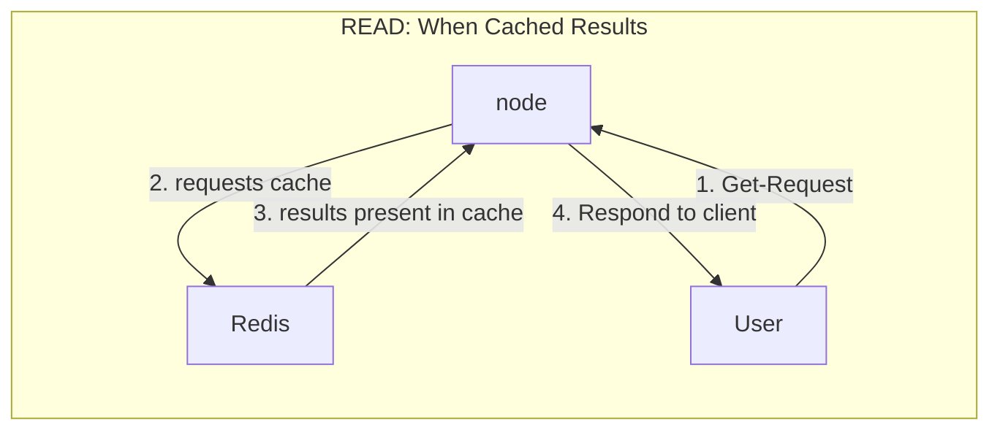
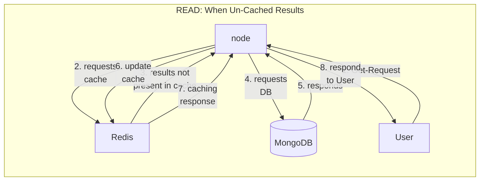
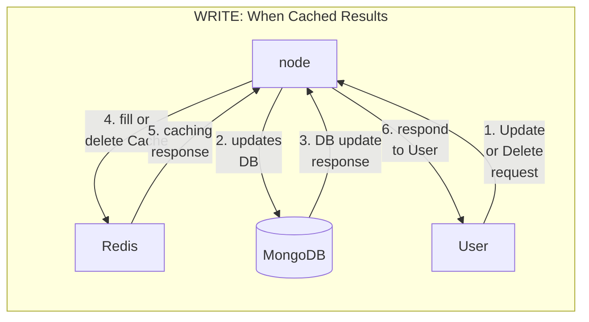

# Products API (Coding Ninjas API Assignment):

Coding Ninjas Backend assignemnt, of Products related eCommerce api. Uses Node (Express), MongoDB and Redis.

Features:
- Use of middlewares (for validation of request fields, and caching).
- Write-through caching using Redis.
- CRUD for products with REST-APIs (see API description below).

Backend hosted at: https://products-api-ux8g.onrender.com/
### **Code Walkthrough:** 

[](https://youtu.be/CN4HpTUrV2E)


------------------------------------------------------------------------------------------
## APIs
### Create Product
<p>
<details>
 <summary><code>POST</code> <code><b>/products/create</b></code> <i>Creates a product with `name` and `quantity`.</i></summary>

##### Body Parameters

> | param      |  type     | data type               | description                                                           |
> |-----------|-----------|-------------------------|-----------------------------------------------------------------------|
> | name      |  required | string   | non empty name of product  |
> | quantity      |  required | number   | number in range [0,10,000]  |

##### Example URL

> ```javascript
>  https://products-api-ux8g.onrender.com/products/create
> ```

</details>
</p></br>

### Get product(s)
<p>
<details>
 <summary><code>GET</code> <code><b>/{:productId}</b></code> <i>Get a product by id.</i></summary>

##### Path Parameters: /products/:productId

> | path-param      |  type     | data type               | description                                                           |
> |-----------|-----------|-------------------------|-----------------------------------------------------------------------|
> | productId      |  required | mongoDb.ObjectId   | id of product  |

##### Example URL

> ```javascript
>  https://products-api-ux8g.onrender.com/products/640e382a014d5341380a599a
> ```

</details>

<details>
 <summary><code>GET</code> <code><b>/products/</b></code> <i>Gets all products</i></summary>

##### Example cURL

> ```javascript
>  https://products-api-ux8g.onrender.com/products/
> ```

</details>
</p></br>

### Updates quantity of existing product

<p><details>
  <summary><code>PATCH</code> <code><b>products/{productId}/update_quantity?number={number}</b></code> <i>Updates quantity of product with productId. Final quantity only allowed in [0,10,000]</i></summary>

##### Path Params

> | name              |  type     | data type      | description                         |
> |-------------------|-----------|----------------|-------------------------------------|
> | `productId` |  required | MongoDB.OjecttId   | MongoDB unique Id of product        |
> | `number` |  required | number   | Number to add or substract to updated quantity. In range [-10_000,10_000].        |

##### Example URL

> ```javascript
>  http://localhost:8001/products/640e382a014d5341380a599a/update_quantity?number=20
> ```

</details></p></br>

### Deleting existing product by ID:

<p><details>
  <summary><code>DELETE</code> <code><b>/products/:productId</b></code> <code>Deletes a specific product by ID</code></summary>

##### Path Parameters: /products/:productId

> | path-param      |  type     | data type               | description                                                           |
> |-----------|-----------|-------------------------|-----------------------------------------------------------------------|
> | productId      |  required | mongoDb.ObjectId   | id of product  |

##### Example URL

> ```javascript
>  http://localhost:8001/products/640e382a014d5341380a599a
> ```

</details></p></br>

------------------------------------------------------------------------------------------

## Caching flow:

### **Write through Cache**: 
#### **Read-request flow:**:


#### **Write-request flow:**:

---

## Folder structure:

```
.
├── README.md
└── backend
    ├── config
    │   ├── dev.js (secret dev keys)
    │   ├── keys.js (depending upon envt, populates keys)
    │   └── prod.js (getting prod keys from process.env)
    ├── controllers
    │   └── products-controller.js (product controller)
    ├── index.js (start point of code)
    ├── middlewares (reusable and extensible middlewares)
    │   ├── useCacheIfStored.js (customisable HOC, as per KEYs)
    │   └── validationFactory.js (customisable HOC, as per Joi Schema)
    ├── models
    │   ├── product.js (mongoose schema)
    │   └── validationSchemas.js (collection of Joi schemas).
    ├── package-lock.json
    ├── package.json
    ├── redis
    │   ├── redis.js (promisified wrappers on redis client).
    │   └── redisHelper.js (getting keys, and list of keys in app).
    ├── routes
    │   └── product-routes.js (product related routes of app).
    └── utils
        ├── DTO.js (Data transformation object from MongoDB to API).
        └── ErrorObject.js (Customisable error thrown usually by async code).
```